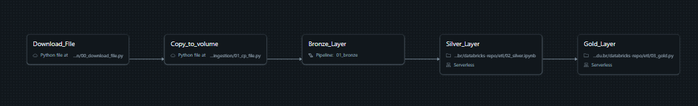

# Plataforma de Análise de Dados do ENEM

Plataforma de análise de dados do exame brasileiro ENEM utilizando a arquitetura *medallion* (Bronze-Silver-Gold) do Databricks para gerar *insights* educacionais.

---

## Descrição da Arquitetura

### Arquitetura Medallion

#### Camada Bronze
* `dicionario_dados` - Dicionário de metadados
* `participantes`, `resultados`, `itens_prova` (Views Materializadas)

#### Camada Silver

Nessa camada a modelagem adotada foi 3NF (Third Normal Form):

* **Dimensões:** `participantes`, `escola`, `municipio`, `unidade_federativa`, `prova`, `questoes`
* **Tabelas de Atributos (Feature Tables):** `ft_faixa_etaria`, `ft_estado_civil`, `ft_cor_raca`, `ft_nacionalidade`, `ft_conclusao`, `ft_ensino`
* **Processamento:** Conversão de tipos, validação, desduplicação (`etl/02_silver.ipynb`)

#### Camada Gold
* `dim_participante_completo` - Dimensão de participante desnormalizada (junção de 10 tabelas)
* `agg_participacao_regional` - Métricas regionais por ano/UF/município
* `agg_perfil_socioeconomico` - Análise socioeconômica
* `agg_tendencias_anuais` - Tendências ano a ano
* **Processamento:** `etl/03_gold.py`

## Justificativa da Estratégia de Join

### Por que LEFT JOINs?
* Preserva todos os participantes, mesmo na ausência de dados de dimensão
* Lida de forma robusta com problemas de qualidade de dados do mundo real
* Requisito de negócio: relatórios completos independentemente da integridade dos dados

---

## Visualização da Linhagem de Dados

O *pipeline* está descrito em [pipeline.yaml](./pipeline.yaml)

